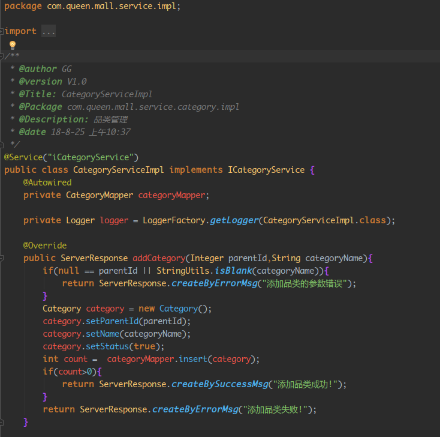
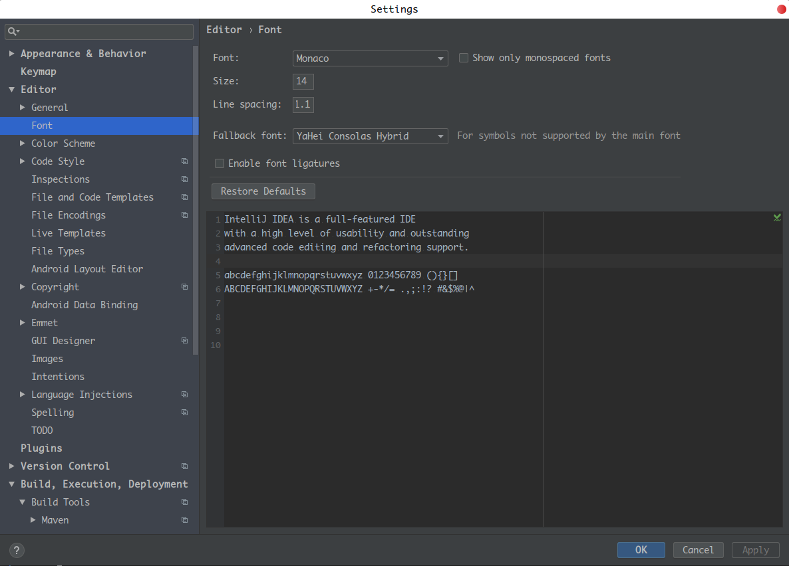

# JetBrainsTheme--MyOneDark
为 JetBrains 打造的OneDark主题

* **效果如下:** 

* **使用方法**:
1. **下载 OneDark.jar**
2. **file –> import setttings –>选择 OneDark.jar –> 确认 –> 重启**
3. **配置字体和文字大小 这是我的配置 : ** 

**字体大家可以到github上找 或者点击这里--> [monaco字体](https://github.com/maxsky/Yahei-Monaco-Hybrid-Font) 获取**
